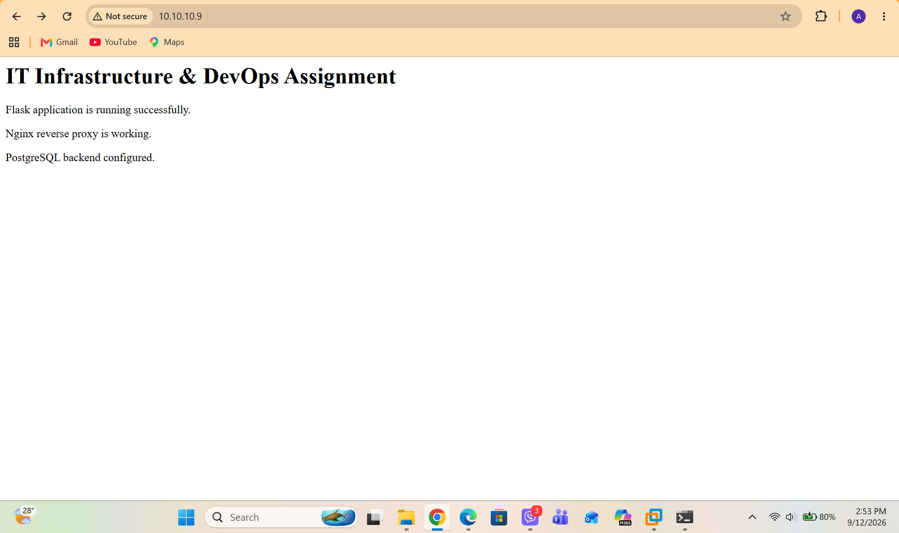

# IT Infrastructure & DevOps Practical Assignment

## Techkraft Inc. — IT Infrastructure & DevOps Engineer Trainee

**Candidate:** Alex Dahal
**Role:** IT Infrastructure & DevOps Engineer Trainee
**Environment:** Ubuntu Linux
**Container Platform:** Docker & Docker Compose
**Reverse Proxy:** Nginx
**Application:** Python Flask
**Database:** PostgreSQL
**Monitoring:** Prometheus & Node Exporter
**Automation:** Bash & Cron
**Version Control:** Git & GitHub

---

## 1. Project Overview

This project demonstrates the end-to-end implementation of an IT infrastructure and DevOps environment based on the requirements provided in the practical assignment.

The implementation covers:

* Linux system provisioning and administration
* Dedicated privileged user configuration
* SSH hardening and key-based authentication
* Non-standard SSH port configuration
* UFW firewall configuration
* Docker and Docker Compose
* Multi-container application architecture
* Nginx reverse proxy
* Python Flask backend application
* PostgreSQL database with persistent storage
* Bash-based infrastructure health monitoring
* Automated health checks using Cron
* PostgreSQL database backup and restoration
* Prometheus and Node Exporter monitoring
* Git branching and version control
* Operational documentation and verification evidence

The project was designed with basic security, service isolation, persistence, automation, monitoring, and disaster recovery principles in mind.

---

# 2. Architecture

The implemented environment follows the architecture below:

```text
                         Client / Browser
                                |
                                | HTTP :80
                                v
                    +-----------------------+
                    |    Nginx Container    |
                    |    Reverse Proxy      |
                    |        :80            |
                    +-----------+-----------+
                                |
                                | Docker Network
                                | HTTP :5000
                                v
                    +-----------------------+
                    |    Flask Application  |
                    |       Python          |
                    |        :5000          |
                    +-----------+-----------+
                                |
                                | PostgreSQL
                                | :5432
                                v
                    +-----------------------+
                    |    PostgreSQL DB      |
                    |   Persistent Volume   |
                    +-----------------------+


              Monitoring Infrastructure
              
                    +-----------------------+
                    |      Prometheus       |
                    |        :9090          |
                    +-----------+-----------+
                                |
                                | Metrics
                                v
                    +-----------------------+
                    |    Node Exporter     |
                    |        :9100          |
                    +-----------+-----------+
                                |
                                v
                         Ubuntu Host


Host-level automation:

    /opt/scripts/infra_health_check.sh
    /opt/scripts/db_backup.sh

    /var/log/infra_health.log
    /var/backups/db/
```

---

# 3. Project Directory Structure

```text
devops-infrastructure-assignment/
│
├── README.md
├── .gitignore
|
│
├── app/
│   ├── Dockerfile
│   ├── app.py
│   └── requirements.txt
│
├── nginx/
│   |-- nginx.conf
│   |---docker-compose.yml
├── monitoring/
│   └── prometheus.yml
│
├── scripts/
│   ├── infra_health_check.sh
│   └── db_backup.sh
│
└── screenshots/
    ├── ufw-status.png
    ├── docker-ps.png
    ├── browser-output.png
    ├── health-check.png
    └── health-log.png
```

---

# 4. Environment Details

## Operating System

```text
Ubuntu Linux
```

## Main Components

| Component      | Purpose                       |
| -------------- | ----------------------------- |
| Ubuntu         | Infrastructure host           |
| SSH            | Secure remote administration  |
| UFW            | Host firewall                 |
| Docker         | Container runtime             |
| Docker Compose | Multi-container orchestration |
| Nginx          | Reverse proxy                 |
| Flask          | Backend application           |
| PostgreSQL     | Relational database           |
| Prometheus     | Metrics collection            |
| Node Exporter  | Host metrics exporter         |
| Bash           | Infrastructure automation     |
| Cron           | Scheduled jobs                |
| Git            | Version control               |

---

# 5. Task 1 — System Provisioning & Linux Administration

## 5.1 Dedicated User

A dedicated user named `traniee` was created for administrative operations.

```bash
sudo adduser traniee
```

The user was granted sudo privileges:

```bash
sudo usermod -aG sudo traniee
```

Verification:

```bash
groups traniee
```

Expected result includes:

```text
sudo
```

Sudo access was verified using:

```bash
sudo whoami
```

Expected:

```text
root
```

---

# 6. SSH Hardening

SSH was hardened to improve the security of remote administration.

### Security changes implemented

* SSH moved from port `22` to port `2222`
* Direct root login disabled
* Public key authentication enabled
* Password-based SSH authentication disabled

Relevant SSH configuration:

```text
Port 2222
PermitRootLogin no
PubkeyAuthentication yes
PasswordAuthentication no
```

Configuration validation:

```bash
sudo sshd -t
```

SSH service verification:

```bash
sudo systemctl status ssh
```

Port verification:

```bash
sudo ss -tulpn | grep 2222
```

Remote login is performed using:

```bash
ssh -p 2222 trainee@SERVER_IP
```

### Security objective

Disabling direct root login and password authentication reduces the risk of brute-force attacks and ensures administrative access is performed through the dedicated account and SSH key.

---

# 7. UFW Firewall Configuration

UFW was configured using a default-deny inbound policy.

### Default policy

```bash
sudo ufw default deny incoming
sudo ufw default allow outgoing
```

### Allowed ports

```bash
sudo ufw allow 2222/tcp
sudo ufw allow 80/tcp
sudo ufw allow 443/tcp
```

Firewall was enabled using:

```bash
sudo ufw enable
```

Verification:

```bash
sudo ufw status verbose
```

Expected configuration:

```text
2222/tcp    ALLOW    SSH
80/tcp      ALLOW    HTTP
443/tcp     ALLOW    HTTPS
```

PostgreSQL (`5432`) and Flask (`5000`) were intentionally not exposed through the host firewall because they communicate through the Docker internal network.

### Evidence


---

# 8. Task 2 — Containerization & Web Services

Docker and Docker Compose were used to deploy a multi-service application stack.

The stack contains:

1. Nginx
2. Flask application
3. PostgreSQL database
4. Prometheus
5. Node Exporter

---

# 9. Docker Compose Architecture

The main orchestration file is:

```text
docker-compose.yml
```

The application stack is started using:

```bash
docker compose up -d --build
```

Running containers can be verified using:

```bash
docker compose ps
```

or:

```bash
docker ps
```

Expected services:

```text
devops-nginx
devops-app
devops-db
prometheus
node-exporter
```

### Evidence


---

# 10. Nginx Reverse Proxy

Nginx is configured as the external entry point for the application.

Host:

```text
Port 80
```

Nginx forwards incoming requests to:

```text
app:5000
```

The backend service is reachable internally through the Docker network.

Example Nginx routing:

```nginx
location / {
    proxy_pass http://flask_backend;

    proxy_set_header Host $host;
    proxy_set_header X-Real-IP $remote_addr;
    proxy_set_header X-Forwarded-For $proxy_add_x_forwarded_for;
    proxy_set_header X-Forwarded-Proto $scheme;
}
```

This provides the following request flow:

```text
Browser
   |
   | HTTP :80
   v
Nginx
   |
   | Docker internal network
   v
Flask :5000
```

---

# 11. Flask Application

A lightweight Python Flask application was developed for the backend service.

The application provides the following endpoints:

### Application

```text
GET /
```

### Health Check

```text
GET /health
```

Example:

```bash
curl http://localhost/health
```

Expected response:

```json
{
    "status": "UP",
    "service": "flask-app"
}
```

### Database Health

```text
GET /db-health
```

Test:

```bash
curl http://localhost/db-health
```

This endpoint verifies connectivity between the Flask application and PostgreSQL.

---

# 12. PostgreSQL Database

PostgreSQL is deployed as a separate Docker service.

The database uses a named Docker volume:

```yaml
volumes:
  - postgres_data:/var/lib/postgresql/data
```

This ensures database data survives container restarts.

Database connectivity is intentionally kept inside the Docker network rather than exposing PostgreSQL directly to the Internet.

---

# 13. Persistent Storage Verification

The PostgreSQL volume can be checked using:

```bash
docker volume ls
```

Inspect the volume:

```bash
docker volume inspect postgres_data
```

The database remains persistent when containers are restarted:

```bash
docker compose restart
```

Database data is not lost because the PostgreSQL data directory is backed by a persistent Docker volume.

---

# 14. Reverse Proxy Verification

Local verification:

```bash
curl http://localhost/
```

Remote verification:

```text
http://SERVER_IP/
```

The browser displays the Flask application through Nginx.

### Evidence



This verifies:

```text
Client → Nginx → Flask
```

---

# 15. Task 3 — Infrastructure Health Check

A Bash script was created to monitor basic infrastructure health.

Script:

```text
/opt/scripts/infra_health_check.sh
```

The repository copy is maintained under:

```text
scripts/infra_health_check.sh
```

---

# 16. Health Check Functions

The script checks:

### CPU

Reports current CPU utilization.

### Memory

Reports RAM utilization.

### Root Disk

Checks root filesystem utilization.

### Docker

Verifies whether the Docker service is running.

### Application Container

Checks whether:

```text
devops-app
```

is running.

### Disk Warning Threshold

A warning is generated when:

```text
Root disk usage > 85%
```

### Application Failure

A warning is generated when:

```text
devops-app
```

is stopped or unavailable.

---

# 17. Health Check Execution

Run manually:

```bash
/opt/scripts/infra_health_check.sh
```

Example output:

```text
========================================
Infrastructure Health Check
Time: 2026-09-12 17:00:00
========================================
CPU Usage: 4.25%
RAM Usage: 21.32%
Root Disk Usage: 32%
Docker Status: RUNNING
Application Container: RUNNING
Health Check Result: OK
========================================
```

### Evidence


---

# 18. Warning and Logging

Warnings are generated when the application container is stopped or disk utilization exceeds 85%.

Warning logs are stored in:

```text
/var/log/infra_health.log
```

Example:

```text
[2026-09-12 17:05:00] [WARNING] Application container is stopped
```

Verification:

```bash
cat /var/log/infra_health.log
```

### Failure scenario tested

The application container was intentionally stopped:

```bash
docker stop devops-app
```

The health check was executed:

```bash
/opt/scripts/infra_health_check.sh
```

The script detected the failure and generated:

```text
[WARNING] Application container is stopped
```

The event was appended to:

```text
/var/log/infra_health.log
```

The application was then restored:

```bash
docker start devops-app
```

### Evidence


---

# 19. Cron Automation

The infrastructure health check is scheduled every 15 minutes.

Cron configuration:

```text
/etc/cron.d/infra-health-check
```

Configuration:

```text
*/15 * * * * trainee /opt/scripts/infra_health_check.sh >> /var/log/infra_health_cron.log 2>&1
```

This executes the health check at:

```text
00
15
30
45
```

minutes of every hour.

Verify:

```bash
cat /etc/cron.d/infra-health-check
```

Verify Cron service:

```bash
sudo systemctl status cron
```

---

# 20. Task 4 — Database Backup & Disaster Recovery

A PostgreSQL backup script was implemented:

```text
/opt/scripts/db_backup.sh
```

Repository copy:

```text
scripts/db_backup.sh
```

The script uses PostgreSQL `pg_dump` and gzip compression.

---

# 21. Backup Location

Backups are stored under:

```text
/var/backups/db/
```

Naming convention:

```text
db_backup_YYYYMMDD.sql.gz
```

Example:

```text
db_backup_20260912.sql.gz
```

Execute:

```bash
/opt/scripts/db_backup.sh
```

Verify:

```bash
ls -lh /var/backups/db/
```

---

# 22. Backup Retention

The backup process includes a basic retention mechanism.

Backups older than seven days are automatically removed.

This prevents unlimited backup growth and reduces the risk of disk exhaustion.

Retention policy:

```text
7 days
```

---

# 23. Database Restore Procedure

The backup can be restored using PostgreSQL's `psql`.

Example:

```bash
gunzip -c /var/backups/db/db_backup_20260912.sql.gz | \
docker exec -i devops-db \
psql -U devops -d devopsdb
```

For a complete recovery scenario, the database can first be recreated and then restored from the backup.

Verification:

```bash
docker exec -it devops-db \
psql -U devops -d devopsdb
```

Then:

```sql
SELECT * FROM assignment_test;
```

The restored data should be available after a successful recovery.

---

# 24. Backup Validation

The backup process was tested by:

1. Creating test data in PostgreSQL
2. Running the backup script
3. Verifying the `.sql.gz` archive
4. Recreating the database
5. Restoring the backup
6. Querying the database
7. Confirming that the original test data was recovered

This validates both the backup and disaster recovery procedure.

---

# 25. Monitoring — Prometheus & Node Exporter

Basic infrastructure monitoring was implemented using:

```text
Prometheus
+
Node Exporter
```

### Node Exporter

Node Exporter collects host-level metrics such as:

* CPU utilization
* Memory utilization
* Disk statistics
* Filesystem statistics
* System load
* Network statistics

### Prometheus

Prometheus periodically scrapes metrics from Node Exporter.

Configured scrape interval:

```text
15 seconds
```

Prometheus target:

```text
node-exporter:9100
```

---

# 26. Monitoring Verification

Check the containers:

```bash
docker ps
```

Check Node Exporter metrics:

```bash
docker exec prometheus \
wget -qO- http://node-exporter:9100/metrics | head
```

Prometheus interface:

```text
http://localhost:9090
```

Verify:

```text
Status → Targets
```

The Node Exporter target should show:

```text
UP
```

Example Prometheus queries:

```text
node_cpu_seconds_total
```

and:

```text
node_memory_MemAvailable_bytes
```

---

# 27. Monitoring Security

Prometheus port `9090` was not added to the public UFW rules because the assignment specifies that only the following inbound ports should be allowed:

```text
2222
80
443
```

For remote administration/testing, Prometheus can be accessed securely using SSH port forwarding:

```bash
ssh -L 9090:localhost:9090 -p 2222 traniee@SERVER_IP
```

Then access:

```text
http://localhost:9090
```

This avoids unnecessarily exposing the monitoring interface publicly.

---

# 28. Git Version Control

Git was used to maintain the project configuration and scripts.

Repository initialization:

```bash
git init
```

The project uses the following branches:

```text
main
feature/docker-setup
feature/scripts
```

---

# 29. Git Branching Strategy

## Docker configuration

Branch:

```text
feature/docker-setup
```

Commit:

```bash
git commit -m "feat: add Docker multi-service web stack"
```

This branch contains:

* Docker Compose
* Nginx configuration
* Flask application
* PostgreSQL configuration
* Monitoring configuration

---

## Automation scripts

Branch:

```text
feature/scripts
```

Commit:

```bash
git commit -m "feat: add infrastructure health and database backup scripts"
```

This branch contains:

* Infrastructure health check
* Database backup script

---

# 30. Branch Merge

Feature branches were merged into `main`.

Example:

```bash
git checkout main
git merge feature/docker-setup
git merge feature/scripts
```

Git history can be reviewed using:

```bash
git log --oneline --graph --all
```

This demonstrates feature-based development and controlled integration into the main branch.

---

# 31. Security Considerations

The following security measures were implemented:

### Host Security

* Dedicated `traniee` account
* Sudo-based administrative access
* Direct root SSH login disabled
* SSH moved to port 2222
* SSH public-key authentication
* Password authentication disabled
* UFW enabled
* Default incoming traffic denied

### Container Security

* Services separated into individual containers
* Flask and PostgreSQL are not publicly exposed
* Internal Docker networking used for application-to-database communication
* PostgreSQL data stored in a persistent volume

### Monitoring Security

* Prometheus is not exposed through UFW
* SSH tunneling can be used for secure remote access

### Credential Security

Production credentials and secrets are not committed to the public repository.

The credentials included in the Docker Compose configuration are demonstration-only credentials for this assignment.

---

# 32. Verification Summary

The following commands can be used to verify the completed environment.

## SSH

```bash
sudo ss -tulpn | grep 2222
```

## Firewall

```bash
sudo ufw status verbose
```

## Docker

```bash
docker ps
```

## Docker Compose

```bash
docker compose ps
```

## Nginx

```bash
curl http://localhost/
```

## Application Health

```bash
curl http://localhost/health
```

## Database Health

```bash
curl http://localhost/db-health
```

## Infrastructure Health

```bash
/opt/scripts/infra_health_check.sh
```

## Health Logs

```bash
cat /var/log/infra_health.log
```

## Database Backup

```bash
/opt/scripts/db_backup.sh
```

## Backup Verification

```bash
ls -lh /var/backups/db/
```

## Monitoring

```bash
docker ps | grep prometheus
```

---

# 33. Screenshots & Evidence

The repository contains screenshots demonstrating successful implementation.

| Screenshot           | Demonstrates                            |
| -------------------- | --------------------------------------- |
| `ufw-status.png`     | UFW firewall configuration              |
| `docker-ps.png`      | Running Docker containers               |
| `browser-output.png` | Nginx reverse proxy → Flask application |
| `health-check.png`   | Successful infrastructure health check  |
| `health-log.png`     | Warning detection and logging           |

---

# 34. Setup Instructions

## Clone Repository

```bash
git clone https://github.com/alexdahal12/IT-infra-and-DevOps-test.git
```

Enter the project:

```bash
cd devops
```

---

## Start Application Stack

```bash
docker compose up -d --build
```

Verify:

```bash
docker compose ps
```

---

## Install Scripts

```bash
sudo mkdir -p /opt/scripts
```

Copy scripts:

```bash
sudo cp scripts/infra_health_check.sh /opt/scripts/
sudo cp scripts/db_backup.sh /opt/scripts/
```

Make executable:

```bash
sudo chmod +x /opt/scripts/*.sh
```

---

## Configure Cron

Install the health check schedule:

```bash
sudo nano /etc/cron.d/infra-health-check
```

Add:

```text
*/15 * * * * trainee /opt/scripts/infra_health_check.sh >> /var/log/infra_health_cron.log 2>&1
```

---

# 35. Teardown

Stop containers:

```bash
docker compose down
```

This stops and removes the containers while preserving the PostgreSQL volume.

To completely remove the application and database volume:

```bash
docker compose down -v
```

> **Warning:** `docker compose down -v` removes the PostgreSQL persistent volume and therefore deletes the database data.

---

# 36. Troubleshooting

## Check all containers

```bash
docker ps -a
```

## Check application logs

```bash
docker logs devops-app
```

## Check Nginx logs

```bash
docker logs devops-nginx
```

## Check PostgreSQL logs

```bash
docker logs devops-db
```

## Check Compose logs

```bash
docker compose logs
```

## Check listening ports

```bash
sudo ss -tulpn
```

## Check firewall

```bash
sudo ufw status verbose
```

## Restart complete stack

```bash
docker compose down
docker compose up -d --build
```

---

# 37. Assignment Completion Matrix

| Assignment Requirement   | Implementation       | Verification                |
| ------------------------ | -------------------- | --------------------------- |
| Ubuntu environment       | Ubuntu Linux VM      | `lsb_release -a`            |
| Dedicated `trainee` user | Created with sudo    | `groups trainee`            |
| Sudo privileges          | Configured           | `sudo whoami`               |
| SSH root login disabled  | `PermitRootLogin no` | SSH configuration           |
| SSH key authentication   | ED25519/public key   | SSH login                   |
| SSH port 2222            | Configured           | `ss -tulpn`                 |
| UFW enabled              | Configured           | `ufw status verbose`        |
| Port 2222                | Allowed              | UFW                         |
| Port 80                  | Allowed              | UFW                         |
| Port 443                 | Allowed              | UFW                         |
| Nginx container          | Implemented          | `docker ps`                 |
| Flask application        | Implemented          | `curl /health`              |
| PostgreSQL               | Implemented          | `/db-health`                |
| Persistent DB storage    | Docker volume        | `docker volume ls`          |
| Nginx reverse proxy      | Configured           | Browser / curl              |
| CPU monitoring           | Bash script          | Health check                |
| RAM monitoring           | Bash script          | Health check                |
| Disk monitoring          | Bash script          | Health check                |
| Disk >85% alert          | Implemented          | Failure test                |
| App stopped alert        | Implemented          | Failure test                |
| Warning log              | Implemented          | `/var/log/infra_health.log` |
| Cron                     | Every 15 minutes     | `/etc/cron.d/`              |
| DB backup                | `pg_dump + gzip`     | Backup archive              |
| Backup retention         | 7 days               | Backup script               |
| DB restore               | `gunzip + psql`      | Recovery test               |
| Prometheus               | Implemented          | Prometheus UI               |
| Node Exporter            | Implemented          | Target `UP`                 |
| Git                      | Implemented          | Git history                 |
| Feature branches         | Implemented          | Git branches                |
| Meaningful commits       | Implemented          | Git log                     |
| README                   | Complete runbook     | This document               |
| Screenshots              | Included             | `screenshots/`              |

---

# 38. Conclusion

This project demonstrates a complete basic infrastructure and DevOps workflow covering provisioning, security hardening, containerization, networking, automation, monitoring, backup, disaster recovery, and version control.

The implementation follows a service-isolated architecture where:

```text
External Client
      |
      v
   Nginx :80
      |
      v
 Flask :5000
      |
      v
PostgreSQL :5432
```

Infrastructure health is automated using Bash and Cron, database data is protected through persistent storage and scheduled backups, and system metrics are collected using Prometheus and Node Exporter.

The project also demonstrates Git-based development using feature branches and controlled merges into `main`.

---

## Repository

**GitHub:**
`https://github.com/alexdahal12/IT-infra-and-DevOps-test`

**Primary branch:** `main`

**Feature branches:**

```text
feature/docker-setup
feature/scripts
```

---

## Author

**Alex Dahal**

IT Infrastructure & DevOps Engineer Candidate

---
